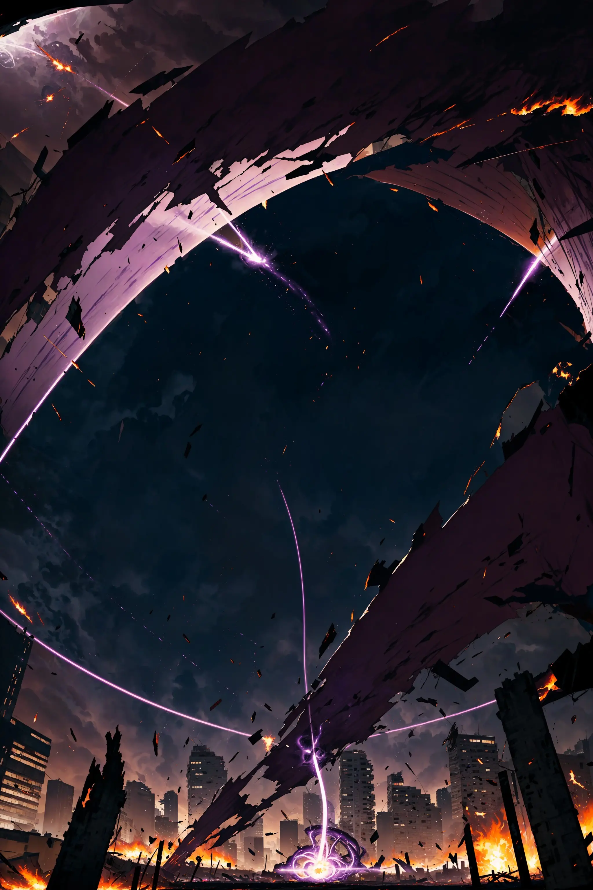
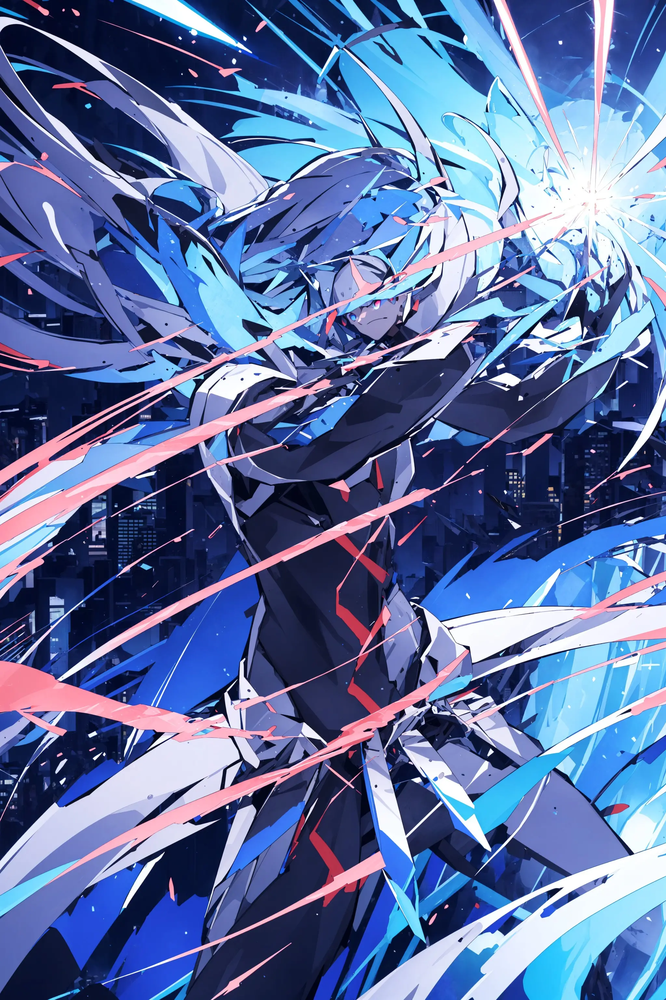
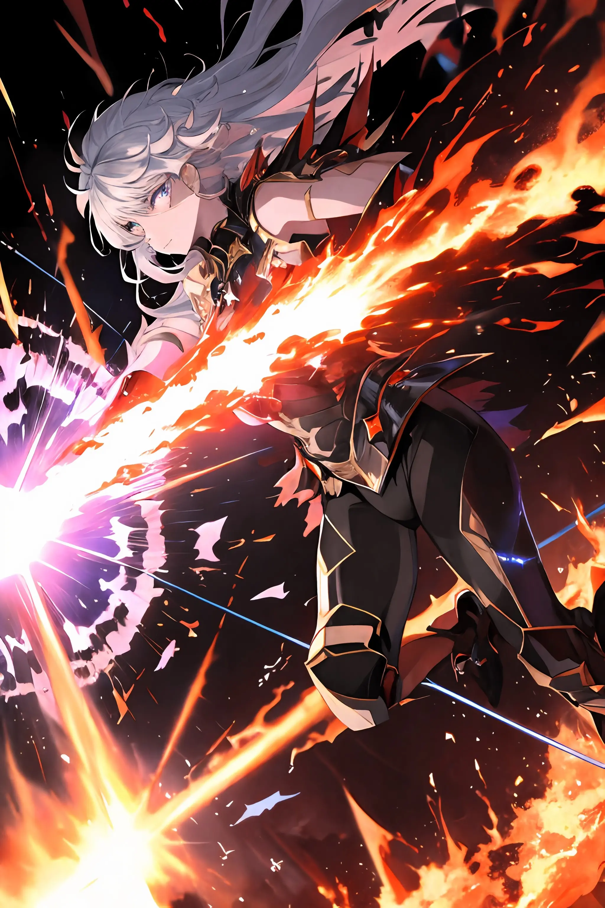

# Konsep Finger Fusion

---

## Penjelasan Singkat:

Finger Fusion merupakan sebuah permainan papan arena strategi yang sedang dikembangkan oleh [Andry Pebrianto](https://github.com/andry-pebrianto). Dalam permainan ini, pemain harus menghancurkan kedua zona lawan atau menghabiskan poin kehidupan lawan untuk meraih kemenangan. Pemain juga dituntut agar terampil dalam menggunakan kartu-kartu efek untuk mendukung permainannya.

---

## Tata Cara dan Aturan Permainan:

1. Pada awal permainan, pemain dan lawan memiliki _**2 Zona**_, di sebelah _**Kiri (Zona A)**_ dan di sebelah _**Kanan (Zona B)**_ dengan masing-masing memiliki _**1 Kekuatan**_.
2. Pada awal permainan, pemain dan lawan masing-masing mambawa _**10 Kartu**_ di tangan, tidak boleh kurang dan/atau lebih.
3. Pada awal permainan, pemain dan lawan masing-masing memiliki _**100 Poin Kehidupan**_.
4. Urutan giliran pertama dan kedua akan ditentukan dengan _**Melempar Koin**_.
5. Terdapat beberapa Fase pada permainan ini, di antaranya:

   - FASE KOIN: Fase ini digunakan untuk memutuskan pemain mana yang akan mendapatkan giliran pertama dengan cara melempar koin. Fase ini tidak akan diulang untuk giliran berikutnya.
   - FASE STRATEGI: _**Pemain**_ yang sedang berada pada giliran ini dapat mengaktifkan kartu bertipe _**Penyerangan**_ dan _**Campuran**_.
   - FASE BERTAHAN: _**Lawan**_ yang sedang berada pada giliran ini dapat mengaktifkan kartu bertipe _**Pertahanan**_ dan _**Campuran**_.
   - FASE MENYERANG: Pada giliran ini _**Pemain**_ dapat menggunakan _**Zona Milik Pemain**_ untuk menyerang _**Zona Milik Lawan**_.

6. Sistem menyerang zona lawan adalah sebagai berikut:

   - Pemain dapat memilih salah satu zona miliknya _**(Zona A/Zona B)**_ untuk menyerang zona lawan _**(Zona A/Zona B)**_.
   - Jika _**Zona A**_ pemain yang memiliki _**1 Kekuatan**_ menyerang _**Zona B**_ lawan yang memiliki _**2 Kekuatan**_, maka lawan akan menerima _**1 Kerusakan**_ sehingga mengurangi _**1 Poin Kehidupan**_-nya. Lantas untuk zona yang sebelumnya diserang akan menambah _**1 Kekuatan**_, sehingga yang awalnya _**2**_ menjadi _**3**_.
   - Jika suatu zona memiliki _**5 Kekuatan**_, maka zona tersebut akan langsung hancur.
   - Jika suatu zona berakhir dengan memiliki kekuatan di atas _**5**_, maka kekuatan dari zona tersebut akan dikurangi 5. Contohnya _**7 Kekuatan**_ akan menjadi _**2 Kekuatan**_, dll dsb.

7. Ketika hanya ada _**1 Zona**_ yang bertahan di arena dan zona tersebut memiliki _**Kekuatan Genap (2/4)**_, maka pemain dapat membelah kekuatan zona tersebut untuk memberikannya pada zona yang sebelumnya telah hancur.
8. Beberapa informasi penting tentang kartu adalah sebagai berikut:
   - Terdapat _**4 Jenis**_ tingkatan kartu, yaitu _**Tingkat C**_, _**Tingkat B**_, _**Tingkat A**_, dan _**Tingkat S**_.
   - Pemain harus membayar sejumlah _**Poin Kehidupan**_ untuk dapat mengaktifkan suatu kartu. Jumlah yang harus dibayar tergantung pada kartu yang hendak diaktifkan.
   - Sejumlah _**Poin Aktivasi**_ dibutuhkan untuk mengaktifkan suatu kartu tertentu. _**Poin Aktivasi**_ sendiri akan secara otomatis bertambah 1 setiap kali masuk ke giliran pemain. Jumlah maksimal tumpukan _**Poin aktivasi**_ adalah _**5**_.
   - Pemain akan mendapatkan _**1 Poin Aktivasi**_ setiap kali mengaktifkan kartu dengan _**Tingkat A**_ dan/atau _**Tingkat S**_, dengan maksimal _**3 Poin Aktivasi**_ yang dapat diterima sepanjang permainan.
   - Pemain hanya dapat membawa maksimal _**1 Kartu Tingkat S**_, _**4 Kartu Tingkat A**_, dan tidak ada batasan untuk tingkat lain di bawahnya.
9. Jika kedua zona pemain hancur, pemain akan mendapatkan opsi untuk mengorbankan _**20 Poin Kehidupan**_ dan akan membangkitkan kembali salah satu zona yang telah hancur. Jika pemain tidak memilih opsi tersebut, maka pemain akan langsung dinyatakan kalah.
10. Jika poin kehidupan pemain berkurang hingga menjadi _**0**_, maka pemain akan langsung dinyatakan kalah.

---

################################## UPCOMING/ON PROGRESS

## Beberapa Hal Penting:

**Zona**:
Zona adalah dua objek yang terletak di sebelah kiri (A) dan kanan (B) arena setiap pemain, termasuk pemain lawan. Setiap zona memiliki power yang diwakili oleh sebuah nilai, yang pada awal permainan memiliki nilai awal satu. Ketika power suatu zona mencapai lima, zona tersebut akan hancur. Pemain yang kedua zonanya telah hancur akan langsung dinyatakan kalah.

**Poin Kehidupan**:
Poin Kehidupan merupakan salah satu faktor kunci dalam menentukan kemenangan. Apabila poin kehidupan pemain mencapai nol, pemain tersebut akan mengalami kekalahan. Pada awal permainan, poin kehidupan pemain dan lawan setara, yaitu seratus. Poin kehidupan dapat berkurang melalui serangan pada zona atau melalui efek khusus dari kartu tertentu.

**Kartu**:
Kartu merupakan hal yang sangat penting dalam permainan ini. Setiap kartu memiliki efek unik yang berbeda. Dengan menggunakan efek kartu yang tepat pada saat yang tepat, situasi permainan dapat berubah dengan cepat. Setiap pemain dapat membawa hingga sepuluh kartu dalam setiap permainan.

**Poin Aktivasi**:
Poin Aktivasi merupakan poin yang digunakan untuk mengaktifkan kartu-kartu tertentu. Setiap kali giliran pemain dimulai, secara otomatis pemain akan mendapatkan 1 Poin Aktivasi. Jumlah Poin Aktivasi yang diperlukan untuk mengaktifkan sebuah kartu bergantung pada tier kartu yang akan diaktifkan tersebut. Jumlah Poin Aktivasi yang dapat ditumpuk adalah lima.

---

## Daftar Kartu:

- ### Tipe Penyerang

  | Nama Kartu          | Efek                                                                                                                                        | Syarat                             | Tier | Biaya            | Ilustrasi                                                         |
  | ------------------- | ------------------------------------------------------------------------------------------------------------------------------------------- | ---------------------------------- | ---- | ---------------- | ----------------------------------------------------------------- |
  | Rampage of Ruin     | Target salah satu zona lawan, hancurkan zona tersebut, lalu lawan akan memulihkan Poin Kehidupan setara dengan power dari zona yang hancur. | Tidak ada.                         | S    | 0 Poin Kehidupan |   |
  | Triple Strike       | Anda dapat menyerang 3 kali pada giliran ini, namun damage untuk setiap serangan akan dikurangi 1.                                          | Tidak ada.                         | S    | 0 Poin Kehidupan |
  | Healing Wave        | Memulihkan 15 Poin Kehidupan untuk anda.                                                                                                    | Poin Kehidupan pemain di bawah 50. | A    | 7 Poin Kehidupan |      |
  | Steal the Spotlight | Lawan akan melewati gilirannya selanjutnya.                                                                                                 | Giliran Global >= 10.              | A    | 6 Poin Kehidupan |
  | Twin Blades of Ruin | Damage dari serangan pada giliran ini akan digandakan.                                                                                      | Poin Kehidupan pemain di bawah 80. | B    | 4 Poin Kehidupan |
  | Swap Surprise       | Pilih satu zona milik anda dan satu zona milik lawan sebagai target, lalu tukar nilai power keduanya.                                       | Giliran Pemain > 2.                | B    | 3 Poin Kehidupan |
  | Wrathful Strike     | Berikan 5 Damage kepada lawan.                                                                                                              | Poin Kehidupan lawan di atas 10.   | B    | 3 Poin Kehidupan |  |
  | Restorative Aura    | Memulihkan 5 Poin Kehidupan pada giliran anda selanjutnya.                                                                                  | Tidak ada.                         | C    | 2 Poin Kehidupan |
  | First Aid           | Memulihkan Poin Kehidupan sebanyak jumlah kartu yang anda aktifkan pada giliran ini.                                                        | Tidak ada.                         | C    | 1 Poin Kehidupan |

- ### Tipe Bertahan

  | Nama Kartu         | Efek                                                                                                                                                                                       | Syarat                              | Tier | Biaya            | Ilustrasi                                                          |
  | ------------------ | ------------------------------------------------------------------------------------------------------------------------------------------------------------------------------------------ | ----------------------------------- | ---- | ---------------- | ------------------------------------------------------------------ |
  | Soul Drainer       | Memulihkan 3 Poin Kehidupan untuk anda, kemudian memberikan 10 damage untuk lawan. Anda akan menerima 1 damage hingga 5 giliran anda ke depan.                                             | Tidak ada.                          | S    | 0 Poin Kehidupan |
  | Attack Repellent   | Batalkan serangan lawan pada giliran ini dan segera akhiri gilirannya.                                                                                                                     | Giliran Global > 6.                 | A    | 8 Poin Kehidupan |
  | Negation Wave      | Pada giliran lawan berikutnya, lawan tidak akan bisa mengaktifkan kartu.                                                                                                                   | Pemain hanya memiliki 1 zona aktif. | A    | 7 Poin Kehidupan |      |
  | Impervious Barrier | Tiap kali zona milik anda akan hancur oleh serangan, zona tersebut tidak akan hancur dan powernya akan menjadi 1, lalu memulihkan 2 Poin Kehidupan.                                        | Poin Kehidupan pemain di bawah 60   | A    | 7 Poin Kehidupan |
  | Dimensional Clash  | Jika lawan menyerang zona anda dan zona anda hancur, zona lawan yang menyerang juga akan hancur. Jika zona anda tidak hancur, lawan akan mendapatkan damage setara serangannya sebelumnya. | Giliran Pemain < 10                 | A    | 6 Poin Kehidupan |  |
  | Zone Annihilation  | Hancurkan satu zona lawan dengan power terkecil.                                                                                                                                           | Lawan memiliki 2 zona aktif.        | B    | 5 Poin Kehidupan |  |
  | Give & Take        | Memulihkan Poin Kehidupan sejumlah power dari zona anda yang hancur di giliran ini.                                                                                                        | Tidak ada.                          | C    | 2 Poin Kehidupan |
  | Pain Reducer       | Semua damage yang diterima dari seranan akan dikurangi 1.                                                                                                                                  | Tidak ada.                          | C    | 1 Poin Kehidupan |       |

- ### Tipe Hybrid

  | Nama Kartu               | Efek                                                                                                                                                  | Tier | Biaya                                                                                    | Ilustrasi                                                            |
  | ------------------------ | ----------------------------------------------------------------------------------------------------------------------------------------------------- | ---- | ---------------------------------------------------------------------------------------- | -------------------------------------------------------------------- |
  | Reflection Tactics       | Pilih satu kartu yang sudah pernah anda gunakan sebelumnya, salin efek kartu tersebut. Jika anda menyalin kartu Tier S, anda akan menerima 10 damage. | A    | Biaya Kartu Yang Disalin   +   1 Poin Kehidupan                                 |    |
  | Rekindle the Spirit      | Jika anda hanya memiliki satu zona yang tersisa, bangkitkan zona anda yang lain dengan membawa satu power.                                            | B    | Fase Strategi   (3 Poin Kehidupan),   Fase Penyerangan   (5 Poin Kehidupan) |  |
  | Inner Energy Refill      | Mendapatkan 3 Poin Aktivasi.                                                                                                                          | B    | 5 Poin Kehidupan                                                                         |
  | Deadly Poison            | Memberikan 2 damage kepada lawan selama 5 giliran lawan ke depan.                                                                                     | B    | 5 Poin Kehidupan                                                                         |
  | Infinite Revitalization  | Memulihkan 1 Poin Kehidupan setiap masuk giliran anda selama 10 giliran anda ke depan.                                                                | B    | 4 Poin Kehidupan                                                                         |       |
  | Inner Energy Refill Lite | Mendapatkan 1 Poin Aktivasi.                                                                                                                          | C    | 2 Poin Kehidupan                                                                         |
  | Plus One Power           | Target salah satu zona anda, jika power pada zona tersebut tidak bernilai 4, tambahkan powernya 1.                                                    | C    | 2 Poin Kehidupan                                                                         |
  | Double Trouble           | Target salah satu zona lawan, jika power pada zona tersebut bernilai 1 atau 2, powernya akan digandakan.                                              | C    | 2 Poin Kehidupan                                                                         |

---

## Biaya Kartu:

- 0: Dimiliki oleh kartu dengan efek yang sangat kuat. Hanya dan sudah pasti dimiliki oleh kartu dengan Tier S.
- 1 - 2: Dimiliki oleh kartu dengan efek yang tidak terlalu kuat dan terbilang biasa saja. Biasanya kartu Tier C.
- 3 - 5: Dimiliki oleh kartu dengan efek yang cukup kuat dan lumayan penting untuk jalannya pertandingan. Biasanya kartu Tier B.
- 6 - 10: Dimiliki oleh kartu dengan efek yang kuat dan dapat dengan mudah mempengaruhi jalannya pertandingan. Biasanya kartu Tier A.

---

## Biaya Poin Aktivasi:

- Kartu Tier S: 3 Poin Aktivasi.
- Kartu Tier A: 2 Poin Aktivasi.
- Kartu Tier B: 1 Poin Aktivasi.
- Kartu Tier C: 1 Poin Aktivasi.
