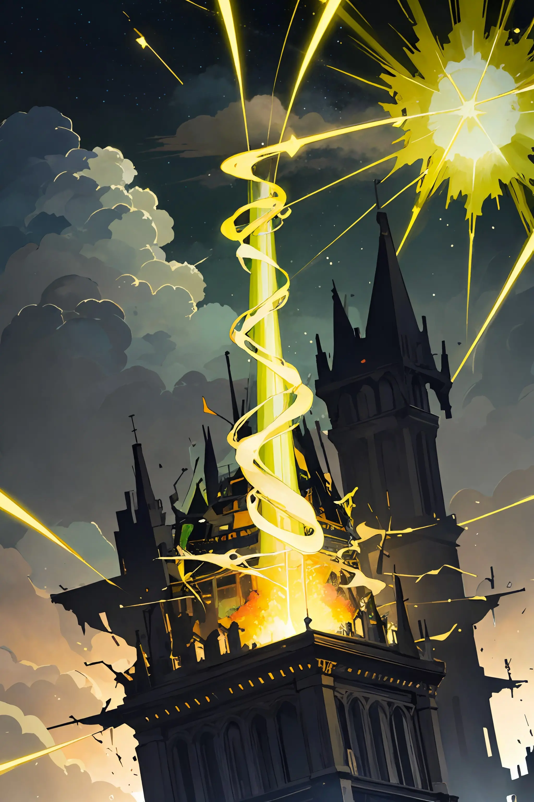
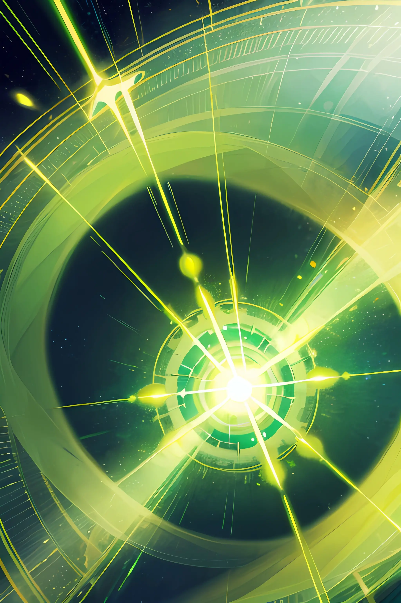
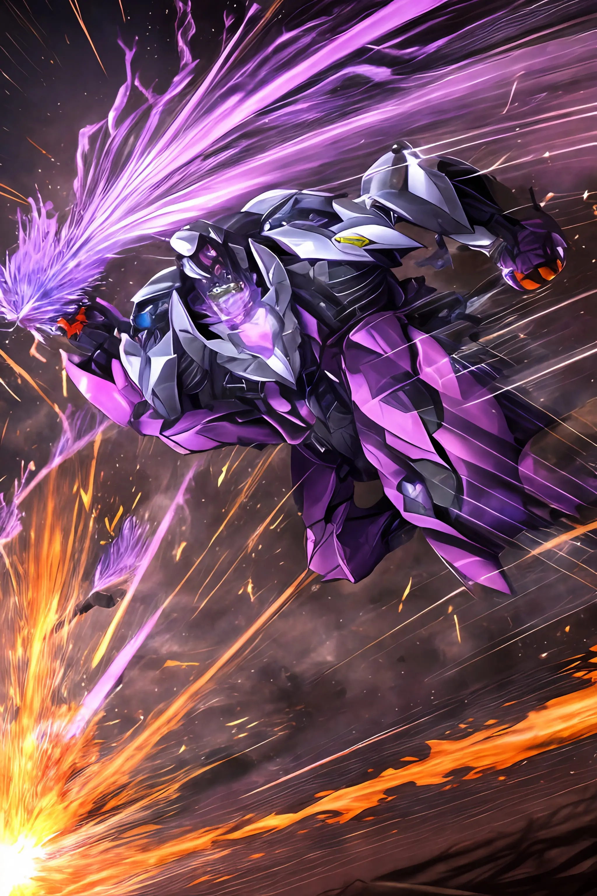
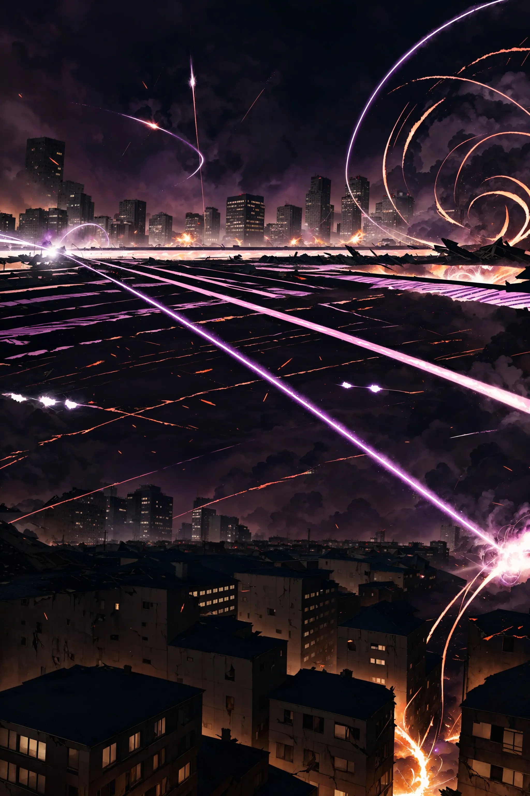
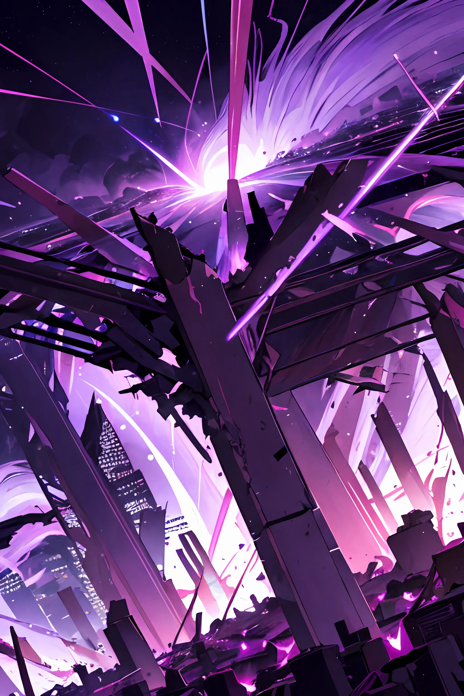
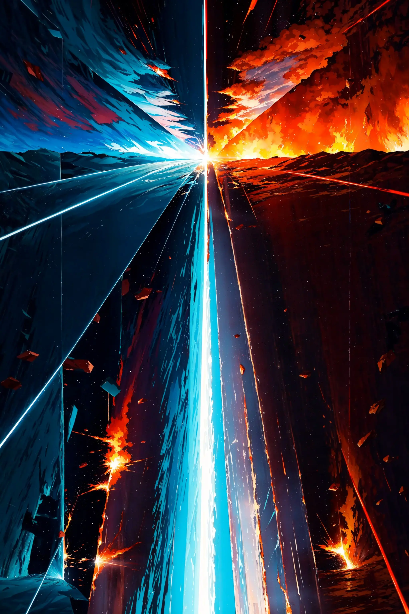
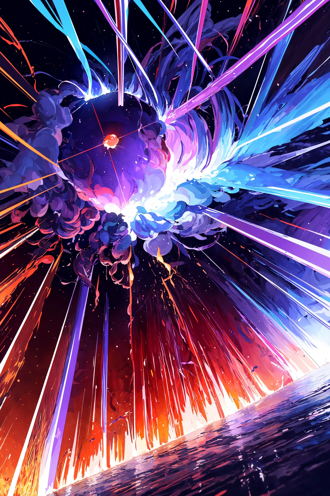

# Konsep Finger Fusion

---

## Penjelasan Singkat:

Finger Fusion merupakan sebuah permainan papan arena strategi yang sedang dikembangkan oleh [Andry Pebrianto](https://github.com/andry-pebrianto). Dalam permainan ini, pemain harus menghancurkan kedua zona lawan atau menghabiskan poin kehidupan lawan untuk meraih kemenangan. Pemain juga dituntut agar terampil dalam menggunakan kartu-kartu efek untuk mendukung permainannya.

---

## Tata Cara dan Aturan Permainan:

1. Pada awal permainan, pemain dan lawan memiliki dua Zona, di sebelah kiri (A) dan di sebelah kanan (B) dengan masing-masing memiliki satu power.
2. Pada awal permainan, pemain dan lawan masing-masing mambawa sepuluh Kartu di tangan.
3. Pada awal permainan, pemain dan lawan masing-masing memiliki seratus Poin Kehidupan.
4. Urutan giliran pertama dan kedua akan ditentukan dengan melempar koin.
5. Zona pemain, baik zona A maupun zona B, dapat menyerang zona milik lawan. Misalnya jika pemain dengan zona A miliknya yang memiliki satu power menyerang zona B milik lawan yang memiliki dua power, maka lawan akan menerima satu damage sehingga mengurangi poin kehidupannya sebanyak satu. Selain itu, power pada zona B lawan yang sebelumnya diserang akan bertambah satu, sehingga menjadi tiga.
6. Ketika suatu zona dengan empat power diserang oleh zona dengan dua power, zona yang sebelumnya memiliki empat power akan menjadi satu karena apabila power melebihi lima setelah kalkulasi penyerangan, maka akan dikurangi sebesar lima.
7. Jika suatu zona memiliki lima power, maka zona tersebut akan hancur.
8. Ketika hanya ada satu zona yang bertahan di arena dan zona tersebut memiliki power genap (empat atau dua), maka zona tersebut dapat membelah dirinya, memberikan setengah powernya kepada zona di sebelahnya yang telah hancur.
9. Terdapat tiga jenis kartu dalam permainan ini, yaitu kartu Penyerang, Bertahan, dan Hybrid.
10. Terdapat dua Fase dalam suatu giliran, yaitu fase Strategi dan fase Penyerangan.
11. Kartu tipe penyerang hanya bisa diaktifkan pada giliran pemain dalam fase strategi pemain.
12. Kartu tipe bertahan hanya bisa diaktifkan pada giliran lawan dalam fase penyerangan lawan.
13. Kartu tipe hybrid bisa diaktifkan pada giliran pemain dalam fase strategi dan giliran lawan dalam fase penyerangan.
14. Setiap kartu memiliki Biaya Pengaktifan masing-masing, di mana biaya tersebut akan mengurangi poin kehidupan pemain yang menggunakannya.
15. Setiap kartu membutuhkan Poin Aktivasi agar dapat diaktifkan.
16. Poin aktivasi secara otomatis akan bertambah 1 setiap kali masuk ke giliran pemain. Jumlah maksimal tumpukan Poin aktivasi adalah lima.
17. Pemain akan mendapatkan 1 poin aktivasi setiap kali mengaktifkan kartu dengan tier A dan/atau tier S, dengan maksimal poin yang bisa diterima adalah 3 poin aktivasi sepanjang permainan.
18. Pemain hanya dapat membawa maksimal satu kartu Tier S, empat kartu Tier A, dan tidak ada batasan untuk kartu Tier B dan C.
19. Jika kedua zona pemain hancur, pemain memiliki opsi untuk mengorbankan 20 poin kehidupan untuk membangkitkan kembali satu zona pemain. Jika pemain tidak memilih opsi tersebut, maka pemain akan langsung dinyatakan kalah.
20. Jika poin kehidupan pemain berkurang hingga menjadi nol, maka pemain akan langsung dinyatakan kalah.

---

## Beberapa Hal Penting:

**Zona**:
Zona adalah dua objek yang terletak di sebelah kiri (A) dan kanan (B) arena setiap pemain, termasuk pemain lawan. Setiap zona memiliki power yang diwakili oleh sebuah nilai, yang pada awal permainan memiliki nilai awal satu. Ketika power suatu zona mencapai lima, zona tersebut akan hancur. Pemain yang kedua zonanya telah hancur akan langsung dinyatakan kalah.

**Poin Kehidupan**:
Poin Kehidupan merupakan salah satu faktor kunci dalam menentukan kemenangan. Apabila poin kehidupan pemain mencapai nol, pemain tersebut akan mengalami kekalahan. Pada awal permainan, poin kehidupan pemain dan lawan setara, yaitu seratus. Poin kehidupan dapat berkurang melalui serangan pada zona atau melalui efek khusus dari kartu tertentu.

**Kartu**:
Kartu merupakan hal yang sangat penting dalam permainan ini. Setiap kartu memiliki efek unik yang berbeda. Dengan menggunakan efek kartu yang tepat pada saat yang tepat, situasi permainan dapat berubah dengan cepat. Setiap pemain dapat membawa hingga sepuluh kartu dalam setiap permainan.

**Poin Aktivasi**:
Poin Aktivasi merupakan poin yang digunakan untuk mengaktifkan kartu-kartu tertentu. Setiap kali giliran pemain dimulai, secara otomatis pemain akan mendapatkan 1 Poin Aktivasi. Jumlah Poin Aktivasi yang diperlukan untuk mengaktifkan sebuah kartu bergantung pada tier kartu yang akan diaktifkan tersebut. Jumlah Poin Aktivasi yang dapat ditumpuk adalah lima.

---

## Daftar Kartu:

- ### Tipe Penyerang

  | Nama Kartu          | Efek                                                                                                                                        | Tier | Biaya            | Ilustrasi                                                        |
  | ------------------- | ------------------------------------------------------------------------------------------------------------------------------------------- | ---- | ---------------- | ---------------------------------------------------------------- |
  | Rampage of Ruin     | Target salah satu zona lawan, hancurkan zona tersebut, lalu lawan akan memulihkan Poin Kehidupan setara dengan power dari zona yang hancur. | S    | 0 Poin Kehidupan |  |
  | Triple Strike       | Anda dapat menyerang 3 kali pada giliran ini, namun damage untuk setiap serangan akan dikurangi 1.                                          | S    | 0 Poin Kehidupan |
  | Steal the Spotlight | Lawan akan melewati giliran setelah ini.                                                                                                    | A    | 8 Poin Kehidupan |
  | Healing Wave        | Memulihkan 15 Poin Kehidupan untuk anda.                                                                                                    | A    | 9 Poin Kehidupan |     |
  | Swap Surprise       | Pilih satu zona milik anda dan satu zona milik lawan sebagai target, lalu tukar nilai power keduanya.                                       | B    | 4 Poin Kehidupan |
  | Twin Blades of Ruin | Damage dari serangan pada giliran ini akan digandakan.                                                                                      | B    | 5 Poin Kehidupan |
  | Restorative Aura    | Memulihkan 5 Poin Kehidupan pada giliran anda selanjutnya.                                                                                  | C    | 2 Poin Kehidupan |
  | First Aid           | Memulihkan Poin Kehidupan sebanyak jumlah kartu yang anda aktifkan pada giliran ini.                                                        | C    | 2 Poin Kehidupan |
  | Wrathful Strike     | Berikan 5 Damage kepada lawan.                                                                                                              | C    | 3 Poin Kehidupan |  |

- ### Tipe Bertahan

  | Nama Kartu         | Efek                                                                                                                                                                                       | Tier | Biaya            | Ilustrasi                                                          |
  | ------------------ | ------------------------------------------------------------------------------------------------------------------------------------------------------------------------------------------ | ---- | ---------------- | ------------------------------------------------------------------ |
  | Soul Drainer       | Memulihkan 3 Poin Kehidupan untuk anda, kemudian memberikan 10 damage untuk lawan. Anda akan menerima 1 damage hingga 5 giliran anda ke depan.                                             | S    | 0 Poin Kehidupan |
  | Negation Wave      | Kartu tidak akan bisa diaktifkan pada giliran lawan berikutnya.                                                                                                                            | A    | 7 Poin Kehidupan |
  | Impervious Barrier | Tiap kali zona milik anda akan hancur oleh serangan, zona tersebut tidak akan hancur dan powernya akan menjadi 1, lalu memulihkan 2 Poin Kehidupan.                                        | A    | 8 Poin Kehidupan |
  | Attack Repellent   | Batalkan serangan lawan pada giliran ini dan segera akhiri gilirannya.                                                                                                                     | A    | 9 Poin Kehidupan |
  | Dimensional Clash  | Jika lawan menyerang zona anda dan zona anda hancur, zona lawan yang menyerang juga akan hancur. Jika zona anda tidak hancur, lawan akan mendapatkan damage setara serangannya sebelumnya. | A    | 7 Poin Kehidupan |  |
  | Zone Annihilation  | Jika lawan memiliki 2 Zona aktif, hancurkan satu zona lawan dengan power terkecil.                                                                                                         | B    | 6 Poin Kehidupan |  |
  | Pain Reducer       | Semua damage yang diterima akan dikurangi 1.                                                                                                                                               | C    | 1 Poin Kehidupan |
  | Give & Take        | Memulihkan Poin Kehidupan sejumlah power dari zona anda yang hancur di giliran ini.                                                                                                        | C    | 2 Poin Kehidupan |

- ### Tipe Hybrid

  | Nama Kartu               | Efek                                                                                                                                                  | Tier | Biaya                                                                                    | Ilustrasi                                                          |
  | ------------------------ | ----------------------------------------------------------------------------------------------------------------------------------------------------- | ---- | ---------------------------------------------------------------------------------------- | ------------------------------------------------------------------ |
  | Reflection Tactics       | Pilih satu kartu yang sudah pernah anda gunakan sebelumnya, salin efek kartu tersebut. Jika anda menyalin kartu Tier S, anda akan menerima 10 damage. | A    | Biaya Kartu Yang Disalin   +   2 Poin Kehidupan                                 |  |
  | Rekindle the Spirit      | Jika anda hanya memiliki satu zona yang tersisa, bangkitkan zona anda yang lain dengan membawa satu power.                                            | B    | Fase Strategi   (5 Poin Kehidupan),   Fase Penyerangan   (7 Poin Kehidupan) |
  | Inner Energy Refill      | Mendapatkan 3 Poin Aktivasi.                                                                                                                          | B    | 5 Poin Kehidupan                                                                         |
  | Deadly Poison            | Memberikan 2 damage kepada lawan selama 5 giliran lawan ke depan.                                                                                     | B    | 6 Poin Kehidupan                                                                         |
  | Infinite Revitalization  | Memulihkan 1 Poin Kehidupan setiap masuk giliran anda.                                                                                                | B    | 7 Poin Kehidupan                                                                         |     |
  | Inner Energy Refill Lite | Mendapatkan 2 Poin Aktivasi.                                                                                                                          | C    | 3 Poin Kehidupan                                                                         |
  | Plus One Power           | Target salah satu zona anda, jika power pada zona tersebut tidak bernilai 4, tambahkan powernya 1.                                                    | C    | 3 Poin Kehidupan                                                                         | 
  | Double Trouble           | Target salah satu zona lawan, jika power pada zona tersebut bernilai 1 atau 2, powernya akan digandakan.                                              | C    | 4 Poin Kehidupan                                                                         |

---

## Biaya Kartu:

- 0: Dimiliki oleh kartu dengan efek yang sangat kuat. Hanya dan sudah pasti dimiliki oleh kartu dengan Tier S.
- 1 - 4: Dimiliki oleh kartu dengan efek yang tidak terlalu kuat dan terbilang biasa saja. Biasanya kartu Tier B dan C.
- 5 - 7: Dimiliki oleh kartu dengan efek yang cukup kuat dan lumayan penting untuk jelannya pertandingan. Biasanya kartu Tier A dan B.
- 8 - 10: Dimiliki oleh kartu dengan efek yang kuat dan dapat dengan mudah mempengaruhi jalannya pertandingan. Biasanya kartu Tier A.

---

## Biaya Poin Aktivasi:

- Kartu Tier S: 3 Poin Aktivasi.
- Kartu Tier A: 2 Poin Aktivasi.
- Kartu Tier B: 1 Poin Aktivasi.
- Kartu Tier C: 1 Poin Aktivasi.
